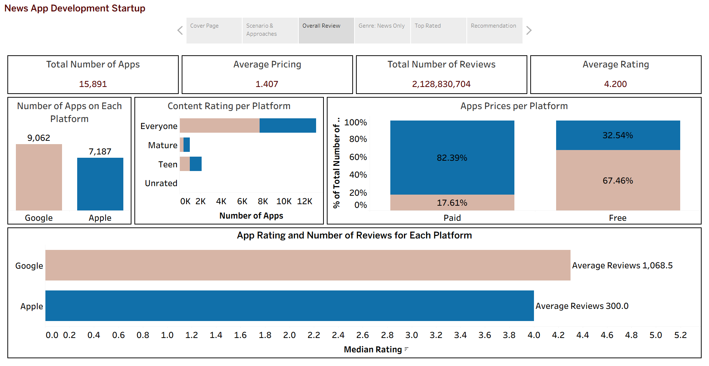
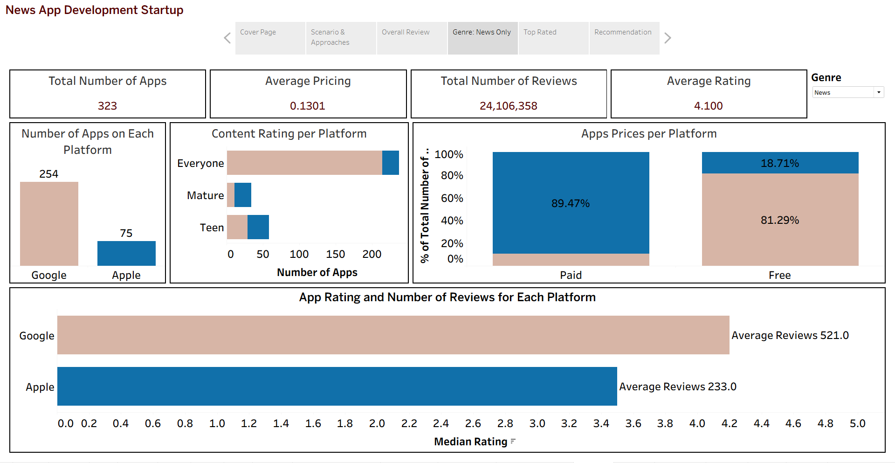

# Mobile App Development - Analysis (Tableau)
A case study on a company that plans to launch a News Application (Apple VS Google)

### Scenario
Briefly Media would like to launch a News Application which pushes notification about global significant events. They aim to **reach as many people as possible**. Also, they are trying to decide between two platfroms: **Google Vs Apple**, as well as the **price point** where they will be keeping the Application at.

### Approaches
1. What is the top platfrom based on Number of apps? 
2. How many genres are in each platfrom?
3. What is the average rating for each platfrom?
4. What is the average number of reviews per platfrom?
5. How is the content rating distributed?
6. What is the price distrubtion per platfrom? 

### Dashboard (Overview/News Specific)

### Recommendations
1. Focus on Google to build a larger and stronger audience.
2. Provide the application for Free, but include sponsored content and Ads to generate Revenue.
3. Add in-app review prompts to boost revenue and app ratings.
